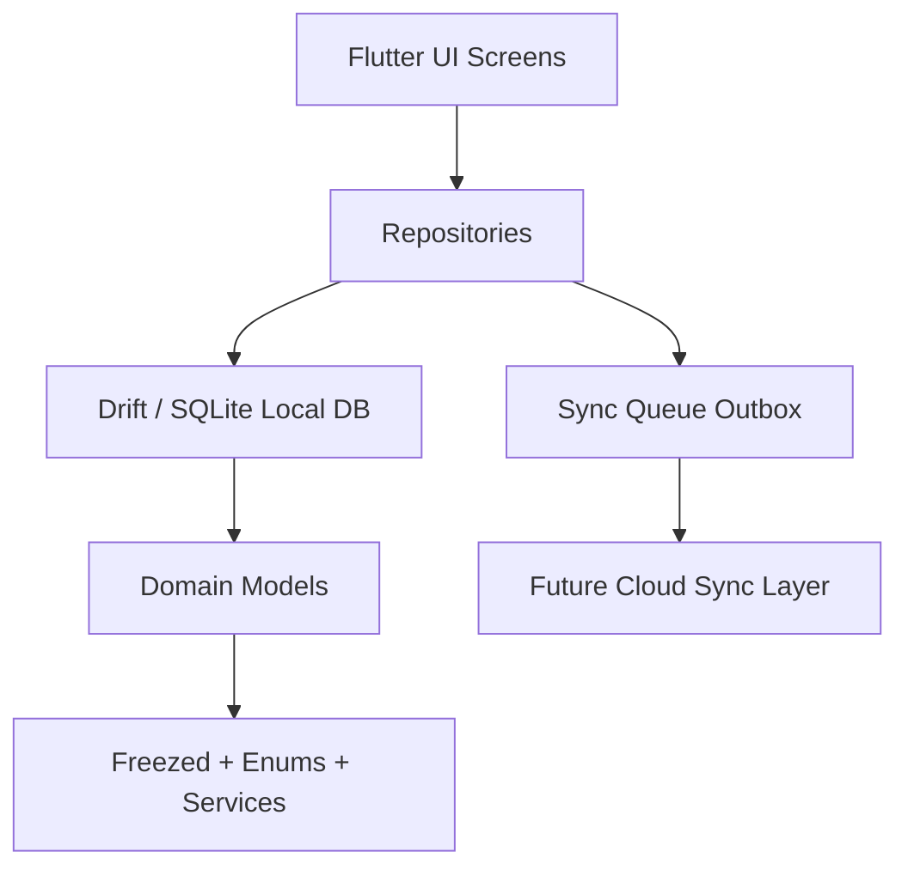
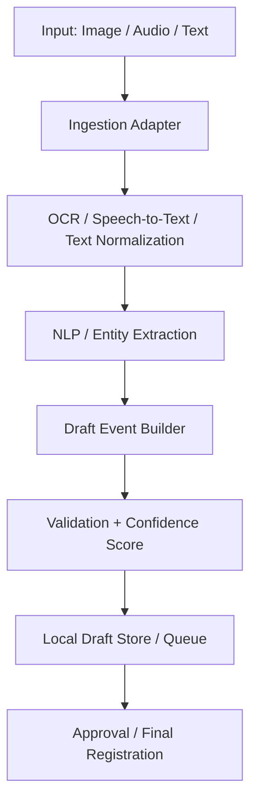

# Cloud Financial X Project Summary

This document is a fast and practical onboarding guide for the project. Its goal is to help you understand the structure, layers, data flow, and main code areas without opening every file manually.

## 1) Project Summary

This is a Flutter mobile/desktop application built with a Local First approach. Data is initially stored in a local SQLite database, and every mutation is also written into a Sync Queue so it can be sent to a server later when connectivity is available.

The project is being developed as a comprehensive cloud financial system that includes:

- Double-entry accounting documents
- Accounting chart of accounts
- Support for multiple financial bases (for example, IRR, USD, EUR, Bitcoin, USDT, and other fiat or crypto units)
- Sales invoices
- Financial transfers
- Inventory management
- Cost centers
- Cloud backup/synchronization
- Future scope: payroll and HR

## 2) High-Level Architecture

## 3) Project Layers

### A) Presentation Layer
Location: lib/screens, lib/ui, lib/widgets

This layer contains the main app screens, forms, shared widgets, and navigation.

Examples:
- Dashboard
- Login/Register
- Product Structure
- Account Structure
- Sale Invoice
- Reports / Wallet / Settings

### B) Application / Repository Layer
Location: lib/data/repository

This layer coordinates read/write operations and manages the sync flow.

Examples:
- ProductRepository
- HesabRepository
- JournalRepository (includes JournalRow behavior)
- CostCenterRepository
- SyncQueueRepository

### C) Domain Layer
Location: lib/domain

This layer defines the domain models, sync contracts, and related business logic.

Examples:
- Product
- Hesab
- Journal
- JournalRow
- CostCenter
- SyncEntity
- SyncQueueRecord
- ConflictResolutionService

### D) Data Layer
Location: lib/data/drift and lib/data/mapper

This layer manages the local database, tables, and mapping logic.

Core tables:
- Products
- SyncQueue
- Hesabs
- Journals
- JournalRows
- CostCenters

## 4) Current Sync Model

The project uses an Outbox pattern:

1. The user or application logic creates a change.
2. The change is written to the local database.
3. In the same transaction, a record is inserted into the SyncQueue table.
4. When network connectivity becomes available, those records should be pushed to the server.

This model is designed to prevent inconsistency between local data and cloud data.

### Important files in this flow
- lib/data/repository/sync_queue_repository.dart
- lib/data/repository/product_repository.dart
- lib/data/repository/hesab_repository.dart
- lib/domain/sync_queue_record.dart
- lib/domain/sync_entity.dart
- lib/data/drift/sync_queue_table.dart

> Important note: the current codebase has the local-first structure and sync queue infrastructure, but the actual server sync layer is not fully implemented yet.

## 5) Smart Data Entry Layer (Important Future Capability)

One of the most important future capabilities of this project is intelligent data entry. In this model, information is received through images, audio, or text and is then automatically converted into unsigned objects or events that are ready for final registration and review.

### Core Concept
- A user or a social-media bot can submit data through an image, audio file, or text.
- The system analyzes the input and extracts key information such as names, dates, amounts, account codes, products, or counterparties.
- The output is an initial draft event that is not yet finalized and is ready for review or correction.

### Role in Architecture
This layer should sit before final persistence and registration, acting as a preprocessing and transformation layer.

### Recommended Implementation Components
- Input adapter: first-screen UI, file upload, voice capture, bot webhook
- OCR service: extract text from images
- Speech-to-Text service: convert audio to text
- NLP/NER service: extract names, amounts, dates, accounts, products, parties
- Draft Event Builder: create initial unsigned objects/events
- Validation layer: quality checks and confidence scoring
- Review/Approval layer: user confirmation or correction

### Recommended Technologies
- OCR: Google ML Kit, Tesseract
- Speech-to-Text: Whisper, Azure Speech, Google STT
- NLP/Persian processing: ParsBERT, GPT/LLM for structured extraction
- Backend/API: Spring Boot with Java for the processing service and APIs, especially given your background
- Local storage: Drift + Sync Queue for drafts

### My Recommendation for the Backend
Given your strong background in Java and Spring Boot, this is the most sensible choice for this project. Spring Boot fits well for building processing services, secure APIs, authentication flows, scheduled jobs, and a modular architecture. If you later expand this system into a multi-user cloud product, Java/Spring Boot will be a strong long-term choice in terms of maintainability, scalability, and team readiness.

### Suggested Backend Architecture
- Service Layer: input processing, extraction, validation
- API Layer: draft management, file upload, data intake
- Domain Layer: event, document, account, product, and financial workflow models
- Persistence Layer: PostgreSQL or MySQL for server data
- Queue / Event Bus: Kafka or RabbitMQ for asynchronous processing
- Auth: Spring Security + JWT

### Suggested Implementation Path
1. Define a Draft/Event schema for extracted data
2. Implement text and image entry in the app
3. Add Speech-to-Text for audio input
4. Build extraction and confidence-scoring logic
5. Convert data into draft records and store them locally
6. Add user approval and final registration in the main workflow

## 6) Fast Path for a New Developer

If you want to get productive quickly, this order is recommended:

1. Read the main app entry point: lib/main.dart
2. Inspect the database layer: lib/data/drift/app_database.dart
3. Review the main repositories: lib/data/repository
4. Review domain models: lib/domain
5. Explore UI pages: lib/screens and lib/ui

## 7) Current Functional Areas

### Products
- Product and unit management
- Pricing and fee-related fields

### Accounting
- Account structure definitions
- Chart of accounts with level-based hierarchy
- Support for main and sub-accounts
- Support for multiple financial bases and currencies in journal entries and journal rows
- Capability to record transactions in fiat, digital assets, and other financial units

### Journal / Documents
- Accounting documents
- Document rows
- Entry balancing and account tracking
- Support for different financial bases at the document and row levels
- Capability to store currency and exchange-rate-related metadata in accounting models

### Cost Centers
- Definition of cost centers for allocation and reporting

### Settings and Development Environment
- General settings
- API and sync settings
- Multiple development modes

## 8) Key Technologies

- Flutter
- Dart
- Drift + SQLite
- Riverpod / Provider
- Go Router
- Freezed
- Path Provider
- UUID

## 9) Current Project Status

### Strengths
- Fairly clear layered structure
- Drift is used for local persistence
- Outbox pattern exists for sync
- Domain models are defined with Freezed
- UI is modular and extensible

### Important future work
- Implement real server sync integration
- Add real API and authentication flow
- Handle conflict resolution and reconciliation
- Add unit and integration tests
- Complete invoice, inventory, and payroll flows

## 10) Recommended Starting Plan

If you are returning to the project, the best approach is:

- Start with the local database and repositories
- Then focus on the main UI and forms
- After that, complete the sync and server layer
- Finally, work on reporting and core business workflows

## 11) Short Summary

This project was initiated around a reliable local-first core and is evolving toward a cloud financial system with support for multiple financial bases and currencies. Understanding the current architecture will significantly ease navigation and extension of subsequent modules.
