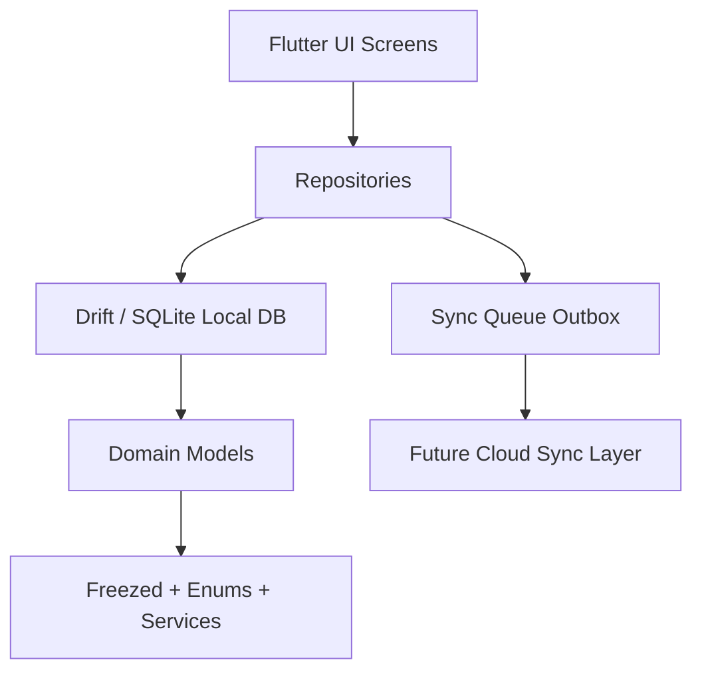
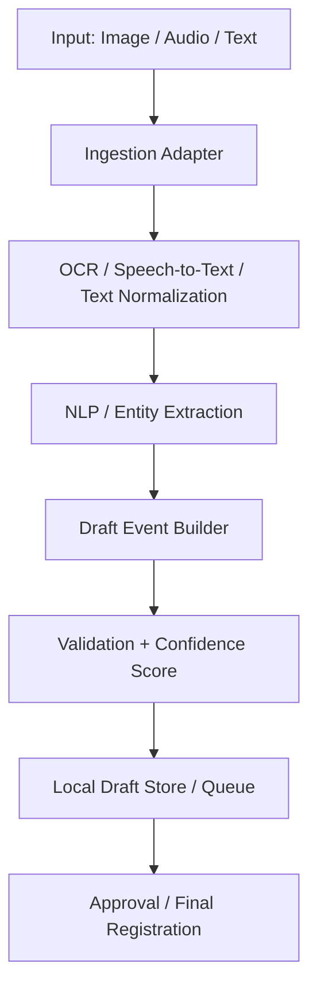

# مستند خلاصه پروژه Cloud Financial X

این سند نسخه‌ای سریع و کاربردی برای ورود به پروژه است. هدف آن کمک به فهم ساختار، لایه‌ها، جریان داده و بخش‌های اصلی کد بدون نیاز به باز کردن همه فایل‌ها است.

## 1) خلاصه‌ی پروژه

این پروژه یک برنامه‌ی موبایل/دسکتاپ Flutter با رویکرد Local First است. داده‌ها در ابتدا در پایگاه‌داده‌ی محلی SQLite ذخیره می‌شوند و هر تغییر نیز به‌صورت همزمان در صف Sync Queue ثبت می‌شود تا در آینده به سرور ارسال شود.

پروژه در حال توسعه‌ی یک سیستم مالی ابری جامع است که شامل موارد زیر است:

- اسناد حسابداری دوطرفه
- سرفصل‌های حسابداری
- پشتیبانی از مبناهای مالی متفاوت (مثلاً ریال، دلار، یورو، بیت‌کوین، تتر و سایر واحدهای ارزی/رمز ارزی)
- فاکتورهای فروش
- انتقالات مالی
- انبارداری
- مرکز هزینه
- پشتیبان‌گیری/همگام‌سازی ابری
- در آینده: حقوق و دستمزد

## 2) معماری کلی

## 3) لایه‌های پروژه

### الف) Presentation Layer
موقعیت: lib/screens، lib/ui، lib/widgets

این بخش شامل صفحات اصلی برنامه، فرم‌ها، ویجت‌های مشترک و ناوبری است.

نمونه‌ها:
- Dashboard
- Login/Register
- Product Structure
- Account Structure
- Sale Invoice
- Reports / Wallet / Settings

### ب) Application / Repository Layer
موقعیت: lib/data/repository

این لایه مسئول هماهنگی عملیات خواندن/نوشتن و نگهداری جریان Sync است.

نمونه‌ها:
- ProductRepository
- HesabRepository
- JournalRepository
- JournalRowRepository
- CostCenterRepository
- SyncQueueRepository

### ج) Domain Layer
موقعیت: lib/domain

در این لایه مدل‌های دامنه، قراردادهای Sync و منطق‌های مرتبط با داده تعریف شده‌اند.

نمونه‌ها:
- Product
- Hesab
- Journal
- JournalRow
- CostCenter
- SyncEntity
- SyncQueueRecord
- ConflictResolutionService

### د) Data Layer
موقعیت: lib/data/drift و lib/data/mapper

این بخش پایگاه‌داده‌ی محلی، جدول‌ها و مپینگ‌ها را مدیریت می‌کند.

جدول‌های اصلی:
- Products
- SyncQueue
- Hesabs
- Journals
- JournalRows
- CostCenters

## 4) مدل Sync فعلی

پروژه از الگوی Outbox استفاده می‌کند:

1. کاربر یا منطق برنامه یک تغییر ایجاد می‌کند.
2. تغییر در دیتابیس محلی ثبت می‌شود.
3. در همان تراکنش، یک رکورد در جدول SyncQueue هم ایجاد می‌شود.
4. در صورت اتصال به شبکه، این رکوردها باید به سرور ارسال شوند.

این مدل برای جلوگیری از ناهماهنگی بین داده‌ی محلی و داده‌ی ابری طراحی شده است.

### فایل‌های مهم در این مسیر
- lib/data/repository/sync_queue_repository.dart
- lib/data/repository/product_repository.dart
- lib/data/repository/hesab_repository.dart
- lib/domain/sync_queue_record.dart
- lib/domain/sync_entity.dart
- lib/data/drift/sync_queue_table.dart

> نکته مهم: در کد فعلی، لایه‌ی Sync به سرور هنوز کاملاً پیاده‌سازی نشده و بیشتر روی Queue و ساختار داده متمرکز است.

## 5) لایه هوشمند ورود اطلاعات (بخش مهم و آینده‌دار)

یکی از مهم‌ترین قابلیت‌های آینده‌ی این پروژه، امکان ورود هوشمند اطلاعات است. در این مدل، اطلاعات از طریق تصاویر، صدا یا متن دریافت می‌شود و سپس به صورت خودکار به اشیاء/رویدادهای امضا نشده تبدیل می‌شوند تا برای ثبت نهایی و تأیید آماده شوند.

### مفهوم اصلی
- کاربر یا یک ربات شبکه‌های اجتماعی می‌تواند داده‌ها را از طریق تصویر، فایل صوتی یا متن دریافت کند.
- سیستم متن/صدا/تصویر را تحلیل می‌کند و اطلاعات کلیدی مثل نام، تاریخ، مبلغ، حساب، کالا یا طرف معامله را استخراج می‌کند.
- خروجی، یک Draft/Event اولیه است که هنوز امضا یا ثبت نهایی نشده و برای بررسی یا اصلاح آماده است.

### نقش این لایه در معماری
این لایه باید قبل از ثبت نهایی داده در لایه‌ی Repository/Domain قرار بگیرد و به‌صورت یک لایه‌ی پیش‌پردازش و تبدیل عمل کند.

### اجزای پیشنهادی برای پیاده‌سازی
- Adapter ورودی: صفحه اول اپ، بارگذاری فایل، ضبط صدا، وب‌هوک ربات
- سرویس OCR: استخراج متن از تصویر
- سرویس Speech-to-Text: تبدیل گفتار به متن
- سرویس NLP/NER: استخراج نام، مبلغ، تاریخ، حساب، کالا، طرف معامله
- Draft Event Builder: ساخت شیء یا رویداد اولیه بدون ثبت نهایی
- Validation Layer: بررسی کیفیت داده و امتیاز اطمینان
- Review/Approval Layer: تایید یا اصلاح توسط کاربر

### تکنولوژی‌های پیشنهادی
- OCR: Google ML Kit، Tesseract
- Speech-to-Text: Whisper، Azure Speech، Google STT
- NLP/Persian Processing: ParsBERT، GPT/LLM برای استخراج ساختارمند
- Backend/API: Spring Boot با Java برای سرویس پردازش و API، به‌ویژه با توجه به تجربه‌ی شما
- ذخیره‌سازی محلی: Drift + Sync Queue برای Drafts

### نظر پیشنهادی من درباره Backend
با توجه به سابقه‌ی شما در Java و Spring Boot، این انتخاب برای این پروژه بسیار منطقی‌تر است. Spring Boot برای ساخت سرویس‌های پردازش داده، APIهای امن، مدیریت auth، jobهای زمان‌بندی و یک معماری ماژولار مناسب است. همچنین اگر در آینده بخواهید این سیستم را به سمت سرویس‌های ابری و چندکاربره توسعه دهید، Java/Spring Boot از نظر نگه‌داری، مقیاس‌پذیری و تیم‌محوری مزیت زیادی دارد.

### پیشنهاد معماری Backend
- Service Layer: پردازش ورودی، استخراج داده، اعتبارسنجی
- API Layer: ثبت و مدیریت Drafts، دریافت فایل‌ها و داده‌ها
- Domain Layer: مدل‌های رویداد، سند، حساب، کالا و پیوند با رویدادهای مالی
- Persistence Layer: PostgreSQL یا MySQL برای داده‌های سرور
- Queue / Event Bus: Kafka یا RabbitMQ برای پردازش غیرهمزمان
- Auth: Spring Security + JWT

### مسیر پیشنهادی اجرا
1. تعریف schema‌ی Draft/Event برای داده‌های استخراج‌شده
2. پیاده‌سازی ورودی متن و تصویر در اپ
3. اضافه‌کردن Speech-to-Text برای ورودی صوتی
4. ساخت موتور استخراج اطلاعات و امتیاز اطمینان
5. تبدیل داده‌ها به Draft و ثبت در پایگاه‌داده محلی
6. اضافه‌کردن تایید کاربر و ثبت نهایی در جریان اصلی سیستم

## 6) مسیر ورود سریع برای توسعه‌دهنده

اگر بخواهید سریع وارد پروژه شوید، این ترتیب پیشنهاد می‌شود:

1. مطالعه فایل اصلی برنامه: lib/main.dart
2. بررسی پایگاه‌داده: lib/data/drift/app_database.dart
3. دیدن Repository‌های اصلی: lib/data/repository
4. بررسی مدل‌های دامنه: lib/domain
5. بازدید صفحات UI: lib/screens و lib/ui

## 7) بخش‌های فعلی برنامه

### محصولات
- مدیریت کالا و واحدهای اندازه‌گیری
- فیلدهای مرتبط با قیمت و کارمزد

### حسابداری
- ساختار حساب‌ها
- سرفصل‌های حسابداری با سطح‌بندی
- امکان تعریف حساب‌های اصلی و فرعی
- پشتیبانی از چندین مبنای مالی و ارز در سندها و ردیف‌های دفتر روزنامه
- امکان ثبت و مدیریت معاملات در ارز فیات، ارز دیجیتال و واحدهای مالی دیگر

### اسناد و دفتر روزنامه
- سندهای حسابداری
- ردیف‌های سند
- تعادل‌سازی و پیگیری حساب‌ها
- پشتیبانی از مبناهای مختلف در سطح سند و ردیف
- امکان ثبت اطلاعات مرتبط با ارز و نرخ تبدیل در مدل‌های حسابداری

### هزینه و مرکز هزینه
- تعریف مرکزهای هزینه برای تخصیص و گزارش‌گیری

### تنظیمات و محیط توسعه
- تنظیمات عمومی
- تنظیمات API و Sync
- محیط‌های توسعه‌ای مختلف

## 8) تکنولوژی‌های کلیدی

- Flutter
- Dart
- Drift + SQLite
- Riverpod / Provider
- Go Router
- Freezed
- Path Provider
- UUID

## 9) وضعیت فعلی پروژه

### نقاط قوی
- ساختار لایه‌بندی نسبتاً واضح
- استفاده از Drift برای داده‌ی محلی
- وجود Outbox برای Sync
- مدل‌سازی دامنه با Freezed
- UI چندبخشی و قابل توسعه

### نکات مهم برای آینده
- پیاده‌سازی لایه‌ی Sync به سرور
- اتصال واقعی به API و auth
- مدیریت conflict و reconciliation
- تست‌های واحد و integration
- تکمیل جریان‌های فاکتور، انبار و حقوق و دستمزد

## 10) پیشنهاد برای شروع کار

اگر قرار است دوباره به پروژه برگردید، بهتر است با این ترتیب پیش بروید:

- ابتدا روی Local DB و Repository‌ها کار کنید
- سپس روی UI و فرم‌های اصلی تمرکز کنید
- بعد از آن Sync و سرور را تکمیل کنید
- در پایان روی گزارش‌ها و جریان‌های کسب‌وکار اصلی کار کنید

## 11) جمع‌بندی کوتاه

این پروژه از یک هسته‌ی محلی‌محور و قابل‌اعتماد آغاز شده و در حال تکامل به سوی یک سیستم مالی ابری با پشتیبانی از چندین مبنای مالی و ارز است. درک ساختار فعلی، ورود به ماژول‌های بعدی را تسهیل خواهد کرد.
